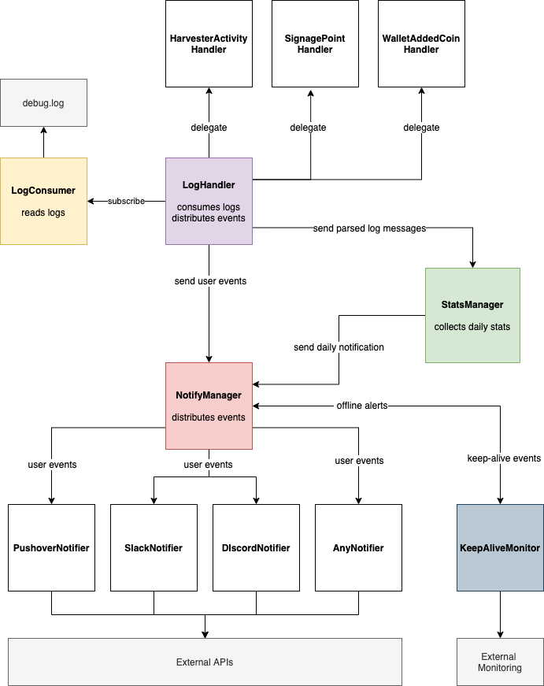

# Contributing

## High-level Architecture Overview

You can get a high-level glimpse on how the different components interact in the diagram below. That should
make it easier to navigate the codebase. Please refer to the in-line code documentation for more information.



You can open and edit the [architecture.drawio](./docs/architecture.drawio) file on [diagrams.net](https://app.diagrams.net).

## How to contribute?

1. Fork the repository
2. Create a feature or bugfix branch from `dev`
3. Push your changes to the branch on your forked repository
4. Submit a PR towards `dev` branch of this repository.

> Note: It's important to base your work on top of the `dev` branch. The `main` branch will only be
> updated once a new release is ready to be pushed. I'll then be merging all changes from `dev` into `main`.

## Commit messages

Please use short and descriptive titles and expand on the "why" inside the body of the commit message if necessary.
In this repository we use the imperative form. For more information on good commit
messages, I recommend the following article:

- [How to Write a Git Commit Message](https://chris.beams.io/posts/git-commit/).

## Formatting and linting

Before submitting a PR make sure that your feature is covered with tests.

1. Install dependencies for auto-formatting and linting:

```
pip3 install black flake8 mypy
```

2. Run formatting, type checking and linting:

```
black src tests && mypy src tests && flake8 src tests
```

3. Run tests:

```
PUSHOVER_API_TOKEN=<your_token> PUSHOVER_USER_KEY=<your_key> TELEGRAM_BOT_TOKEN=<your_token> TELEGRAM_CHAT_ID=<your_chat_id>  python3 -m unittest
```

Check that all passes and there aren't any warnings.

If you did not modify any logic in one of the notifiers, you can skip these tests and run all others without specifying
any tokens:

```
python3 -m unittest
```

## Have fun

Most importantly: Have fun and if you're unsure about some contribution, don't shy away from submit a Pull Request
anyway. We can use that as a basis for discussions, provide feedback and iterate on further improvements. Cheers!